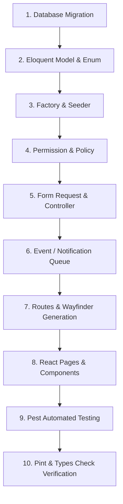

# Technical Documentation

## Daftar Isi

- [Technical Documentation](#technical-documentation)
  - [Daftar Isi](#daftar-isi)
  - [Tech Stack \& Dependencies](#tech-stack--dependencies)
  - [Prasyarat Sistem](#prasyarat-sistem)
  - [Docker \& Makefile Workflows](#docker--makefile-workflows)
    - [1. Jalankan Container Infrastructure Development:](#1-jalankan-container-infrastructure-development)
    - [2. Hentikan Container:](#2-hentikan-container)
    - [3. Perintah Utama Makefile:](#3-perintah-utama-makefile)
  - [Setup Environment \& Pengoperasian Lokal](#setup-environment--pengoperasian-lokal)
    - [1. Instalasi Dependensi](#1-instalasi-dependensi)
    - [2. Konfigurasi File `.env` \& Application Key](#2-konfigurasi-file-env--application-key)
    - [3. Konfigurasi Database \& Migrasi](#3-konfigurasi-database--migrasi)
    - [4. Menjalankan Development Server \& Background Scheduler](#4-menjalankan-development-server--background-scheduler)
  - [Background Scheduler \& Task Runner](#background-scheduler--task-runner)
    - [Command Pengingat Todo Manual:](#command-pengingat-todo-manual)
    - [Menjalankan Scheduler Secara Terpisah:](#menjalankan-scheduler-secara-terpisah)
  - [Urutan Eksekusi Request (Request Lifecycle)](#urutan-eksekusi-request-request-lifecycle)
  - [Panduan Manajemen Permission (Menambah \& Synchronize Permission)](#panduan-manajemen-permission-menambah--synchronize-permission)
    - [1. Tempat Mendefinisikan Permission Baru](#1-tempat-mendefinisikan-permission-baru)
    - [2. Sinkronisasi Permission ke Database Tanpa Menghapus Data Lama](#2-sinkronisasi-permission-ke-database-tanpa-menghapus-data-lama)
    - [3. Penambahan Permission ke Tim yang Sudah Ada (Existing Teams)](#3-penambahan-permission-ke-tim-yang-sudah-ada-existing-teams)
  - [Panduan Pengembangan Fitur Baru (Step-by-Step Developer Guide)](#panduan-pengembangan-fitur-baru-step-by-step-developer-guide)
    - [Langkah 1: Database Migration](#langkah-1-database-migration)
    - [Langkah 2: Model Eloquent, Enum, Casts \& Relasi](#langkah-2-model-eloquent-enum-casts--relasi)
    - [Langkah 3: Factory \& Database Seeder](#langkah-3-factory--database-seeder)
    - [Langkah 4: Permission \& Authorization Policy](#langkah-4-permission--authorization-policy)
    - [Langkah 5: Form Request \& Controller Action](#langkah-5-form-request--controller-action)
    - [Langkah 6: Notifikasi \& Queue (Email / Database)](#langkah-6-notifikasi--queue-email--database)
    - [Langkah 7: Routing \& Wayfinder TypeScript Generation](#langkah-7-routing--wayfinder-typescript-generation)
    - [Langkah 8: Tipe TypeScript, Halaman React \& Komponen UI](#langkah-8-tipe-typescript-halaman-react--komponen-ui)
    - [Langkah 9: Automated Testing dengan Pest PHP](#langkah-9-automated-testing-dengan-pest-php)
    - [Langkah 10: Formatting \& Verifikasi Akhir](#langkah-10-formatting--verifikasi-akhir)
  - [Panduan Komponen Arsitektur \& Packages](#panduan-komponen-arsitektur--packages)
    - [1. Service Provider](#1-service-provider)
    - [2. Routing \& Route Model Binding](#2-routing--route-model-binding)
    - [3. Middleware Stack](#3-middleware-stack)
    - [4. Eloquent Model \& Events](#4-eloquent-model--events)
    - [5. Inertia.js + React (SPA tanpa API)](#5-inertiajs--react-spa-tanpa-api)
    - [6. Spatie Data (DTO Modern)](#6-spatie-data-dto-modern)
    - [7. Spatie Permission \& Dynamic Team RBAC](#7-spatie-permission--dynamic-team-rbac)
    - [8. Spatie MediaLibrary (Upload File)](#8-spatie-medialibrary-upload-file)
    - [9. Spatie ActivityLog (Audit Trail)](#9-spatie-activitylog-audit-trail)
    - [10. Spatie QueryBuilder (Filter \& Sort Otomatis)](#10-spatie-querybuilder-filter--sort-otomatis)
    - [11. Wayfinder (Type-safe Routes di Frontend)](#11-wayfinder-type-safe-routes-di-frontend)
    - [12. Fitur PHP 8.x Modern](#12-fitur-php-8x-modern)
  - [Perintah Testing, Linting \& Debugging](#perintah-testing-linting--debugging)
    - [Automated Testing (Pest):](#automated-testing-pest)
    - [Code Formatting (Laravel Pint):](#code-formatting-laravel-pint)
    - [Static Analysis \& Type Checking:](#static-analysis--type-checking)
    - [Debugging Tools:](#debugging-tools)
  - [Struktur Arsitektur Project](#struktur-arsitektur-project)

---

## Tech Stack & Dependencies

- **Backend**: PHP 8.4, Laravel 11 / 13, Laravel Fortify, Laravel Socialite, Laravel Passkeys
- **Frontend**: React 19, Inertia.js v3, TypeScript, Tailwind CSS v4, Radix UI, Framer Motion, Lucide Icons
- **Routing & Types**: Laravel Wayfinder (`@/actions`, `@/routes`)
- **Database & Query**: MySQL / PostgreSQL / SQLite, `spatie/laravel-query-builder`, `spatie/laravel-permission`, `spatie/laravel-activitylog`, `spatie/laravel-medialibrary`
- **Testing & Quality**: Pest PHP 5, Laravel Pint, PHPStan / Larastan

---

## Prasyarat Sistem

- **PHP** `>= 8.3` (ekstensi: `pdo`, `mbstring`, `openssl`, `bcmath`, `curl`)
- **Composer** `>= 2.6`
- **Node.js** `>= 20.x` & **npm** `>= 10.x`
- **Database Server**: MySQL 8.x / PostgreSQL 15+ / SQLite3
- **Docker / Podman** *(opsional, jika menggunakan container)*

---

## Docker & Makefile Workflows

Jika menggunakan Docker / Podman untuk mengelola layanan infrastruktur pendukung (MySQL, Redis, Mailpit, RustFS/S3):

### 1. Jalankan Container Infrastructure Development:
```bash
make up-dev
# ATAU (menggunakan docker compose secara langsung):
docker compose -f compose.dev.yml up -d
```

### 2. Hentikan Container:
```bash
make down-dev
# ATAU
docker compose -f compose.dev.yml down
```

### 3. Perintah Utama Makefile:
- `make setup` : Setup awal proyek secara otomatis (composer, env, key generate, storage link, migrate --seed, npm install, build, wayfinder).
- `make up-dev` : Menjalankan container Docker dev (MySQL, Redis, Mailpit, S3).
- `make down-dev` : Menghentikan container Docker dev.
- `make run` / `make dev` : Menjalankan dev server Laravel & Vite secara bersamaan (`composer run dev`).
- `make fresh` : Reset database & seeder data (`php artisan migrate:fresh --seed`).
- `make test` : Menjalankan suite pengujian Pest (`php artisan test --compact`).
- `make lint` : Memformat kode PHP dengan Laravel Pint.
- `make wayfinder` : Meng-generate fungsi TypeScript untuk Laravel routes & actions.
- `make clean` : Membersihkan seluruh cache aplikasi (config, route, view, cache).

---

## Setup Environment & Pengoperasian Lokal

### 1. Instalasi Dependensi
```bash
composer install
npm install
```

### 2. Konfigurasi File `.env` & Application Key
```bash
cp .env.example .env
php artisan key:generate
```

### 3. Konfigurasi Database & Migrasi
Sesuaikan kredensial database pada `.env`:
```env
DB_CONNECTION=mysql
DB_HOST=127.0.0.1
DB_PORT=3306
DB_DATABASE=todo_craft
DB_USERNAME=root
DB_PASSWORD=
```

Jalankan migrasi database beserta seeder:
```bash
php artisan migrate:fresh --seed
# ATAU
make fresh
```

### 4. Menjalankan Development Server & Background Scheduler
Perintah terpadu untuk menjalankan HTTP Server, Vite Dev Server, dan **Schedule Worker** (`php artisan schedule:work`) secara bersamaan (*concurrently*):
```bash
make dev
# ATAU
make run
# ATAU
composer run dev
```

Aplikasi berjalan di: `http://localhost:8000`.

---

## Background Scheduler & Task Runner

Perintah `make dev` / `make run` secara otomatis sudah menjalankan `php artisan schedule:work` secara paralel. Namun Anda juga dapat menjalankannya secara terpisah jika diperlukan:

### Command Pengingat Todo Manual:
```bash
php artisan todos:send-reminders
```

### Menjalankan Scheduler Secara Terpisah:
```bash
php artisan schedule:work
```
*(Scheduler mengeksekusi `todos:send-reminders` setiap menit untuk memproses queue notifikasi pengingat)*.

---

## Urutan Eksekusi Request (Request Lifecycle)

Setiap request HTTP dari browser melewati tahapan eksekusi terstruktur berikut:

```text
Browser kirim request
        │
        ▼
  public/index.php          ← Entry point tunggal semua request
        │
        ▼
  bootstrap/app.php          ← Konfigurasi aplikasi dibaca:
                               - withRouting() → route web.php, settings.php, console.php
                               - withMiddleware() → CSRF, web stack
                               - withExceptions() → error handling
        │
        ▼
  bootstrap/providers.php    ← Service Provider di-register & di-boot:
                               AppServiceProvider::register() / boot()
                               FortifyServiceProvider::boot()
        │
        ▼
  routes/web.php / settings.php ← URL dicocokkan dengan route terdaftar
        │
        ▼
  Middleware Stack           ← Dijalankan secara berurutan:
  (Global → Group → Route)    1. HandleAppearance (tema dark/light)
                               2. HandleInertiaRequests (share data ke React)
                               3. SetTeamUrlDefaults (default {current_team})
                               4. auth (cek login)
                               5. verified (cek email verified)
                               6. EnsureTeamMembership (cek keanggotaan tim & scope permission)
        │
        ▼
  Controller Method          ← Logika: authorize → query DB → return response
        │
        ▼
  Response                   ← Inertia::render() → kirim JSON ke React SPA
                               atau redirect() → redirect ke URL lain
```

---

## Panduan Manajemen Permission (Menambah & Synchronize Permission)

Seluruh otorisasi di proyek ini berbasis **permission string dengan format dot notation (`resource.action`)** dan ter-scope per tim via Spatie Permission.

### 1. Tempat Mendefinisikan Permission Baru

Saat ingin membuat permission baru (misal: `reports.view` atau `projects.manage`), perbarui 3 file berikut:

1. **`database/seeders/RoleAndPermissionSeeder.php`**:
   Tambahkan string permission baru ke dalam array `public const PERMISSIONS`:
   ```php
   public const PERMISSIONS = [
       'dashboard.view',
       'teams.update',
       // ...
       'reports.view', // ← Tambahkan di sini
   ];
   ```

2. **`app/Enums/TeamPermission.php`**:
   Tambahkan case baru pada Backed Enum PHP:
   ```php
   enum TeamPermission: string
   {
       // ...
       case ViewReports = 'reports.view';
   }
   ```

3. **`app/Actions/Teams/CreateTeam.php`**:
   Tentukan peran tim mana yang otomatis mendapatkan permission tersebut saat tim baru dibuat:
   ```php
   private const DEFAULT_ROLES = [
       TeamRole::Owner->value => RoleAndPermissionSeeder::PERMISSIONS,
       TeamRole::Admin->value => [
           'teams.update',
           // ...
           'reports.view', // ← Tambahkan ke role Admin
       ],
       TeamRole::Member->value => [
           // ...
       ],
   ];
   ```

---

### 2. Sinkronisasi Permission ke Database Tanpa Menghapus Data Lama

Untuk memasukkan permission baru ke database tanpa merusak atau menghapus data pengguna, tim, maupun permission yang sudah ada:

```bash
php artisan db:seed --class=RoleAndPermissionSeeder
```

**Mengapa AMAN & tidak menghapus data lama?**
`RoleAndPermissionSeeder` menggunakan perintah `Permission::firstOrCreate(['name' => $permission, 'guard_name' => 'web'])`. Metode ini hanya membuat record baru jika nama permission belum ada di tabel `permissions`, dan membiarkan permission lama beserta relasi role/user yang sudah ada tetap utuh tanpa disentuh.

---

### 3. Penambahan Permission ke Tim yang Sudah Ada (Existing Teams)

Seeder di atas menambahkan permission secara global di tabel `permissions`. Jika Anda ingin memberikan permission baru tersebut ke **role tim yang sudah dibuat sebelumnya di database**, jalankan snippet berikut via `php artisan tinker`:

```php
use App\Models\Team;
use Spatie\Permission\Models\Role;
use Spatie\Permission\PermissionRegistrar;

app()[PermissionRegistrar::class]->forgetCachedPermissions();

// Berikan permission baru ke role Admin di seluruh tim yang sudah ada
Team::all()->each(function (Team $team) {
    setPermissionsTeamId($team->id);

    $adminRole = Role::where('name', 'admin')->where('team_id', $team->id)->first();
    if ($adminRole) {
        $adminRole->givePermissionTo('reports.view');
    }
});
```

---

## Panduan Pengembangan Fitur Baru (Step-by-Step Developer Guide)



---

### Langkah 1: Database Migration
Buat file migrasi baru untuk membuat atau mengubah tabel database:
```bash
php artisan make:migration create_projects_table
```
- Gunakan tipe data eksplisit (`foreignId('team_id')->constrained()->cascadeOnDelete()`, `string()`, `timestamp()`, `nullable()`).
- Jalankan migrasi:
```bash
php artisan migrate
```

---

### Langkah 2: Model Eloquent, Enum, Casts & Relasi
Buat Model PHP di `app/Models/`:
```bash
php artisan make:model Project
```
- Terapkan PHP 8.4 attributes `#[Fillable(['name', 'team_id'])]` dan `#[Hidden([...])]`.
- Buat Backed Enum di `app/Enums/ProjectStatus.php` jika memiliki kolom berstatus (misal: `enum ProjectStatus: string`).
- Tulis fungsi relasi (`belongsTo(Team::class)`, `hasMany(Todo::class)`) serta tipe casts pada `protected function casts(): array`.

---

### Langkah 3: Factory & Database Seeder
Buat Factory dan Seeder agar data dummy dapat di-generate dengan mudah:
```bash
php artisan make:factory ProjectFactory --model=Project
php artisan make:seeder ProjectSeeder
```
- Daftarkan `ProjectSeeder` pada `database/seeders/DatabaseSeeder.php`.
- Uji cobakan reset database: `make fresh`.

---

### Langkah 4: Permission & Authorization Policy
1. Ikuti [Panduan Manajemen Permission](#panduan-manajemen-permission-menambah--synchronize-permission) di atas untuk menambahkan permission baru.
2. Buat Policy di `app/Policies/`:
```bash
php artisan make:policy ProjectPolicy --model=Project
```
3. Periksa kepemilikan tim dan permission:
```php
public function view(User $user, Project $project): bool
{
    return $user->belongsToTeam($project->team)
        && ($user->ownsTeam($project->team) || $user->hasTeamPermission($project->team, 'projects.view'));
}
```

---

### Langkah 5: Form Request & Controller Action
Buat Form Request untuk validasi input dan Controller untuk menangani HTTP Request:
```bash
php artisan make:request StoreProjectRequest
php artisan make:controller ProjectController
```
- Gunakan `QueryBuilder::for(Project::class)` dari `spatie/laravel-query-builder` untuk pencarian/filtering di DB.
- Kembalikan komponen Inertia React:
```php
return Inertia::render('projects/index', [
    'projects' => $projects,
]);
```
- Berikan respon pesan flash toast jika berhasil:
```php
Inertia::flash('toast', ['type' => 'success', 'message' => __('Proyek berhasil dibuat.')]);
return back();
```

---

### Langkah 6: Notifikasi & Queue (Email / Database)
Jika fitur membutuhkan pengiriman pemberitahuan atau tugas di background:
```bash
php artisan make:notification ProjectCreatedNotification
```
- Terapkan `implements ShouldQueue` agar dikirim secara asynchronous melalui queue.
- Daftarkan channel `'database'` dan `'mail'` pada method `via()`.
- Kirim notifikasi via `$user->notify(new ProjectCreatedNotification($project))`.

---

### Langkah 7: Routing & Wayfinder TypeScript Generation
Daftarkan rute HTTP pada `routes/web.php` atau `routes/settings.php`:
```php
Route::middleware(['auth', EnsureTeamMembership::class])->group(function () {
    Route::get('{team:slug}/projects', [ProjectController::class, 'index'])->name('projects.index');
    Route::post('{team:slug}/projects', [ProjectController::class, 'store'])->name('projects.store');
});
```
- **Wajib**: Jalankan Wayfinder generator agar TypeScript mengenali rute dan controller action secara otomatis:
```bash
make wayfinder
# ATAU
php artisan wayfinder:generate
```

---

### Langkah 8: Tipe TypeScript, Halaman React & Komponen UI
1. Tentukan antarmuka Tipe Data pada `resources/js/types/project.ts`:
```typescript
export interface Project {
    id: number;
    name: string;
    status: string;
    created_at?: string;
}
```
2. Buat Halaman Inertia React pada `resources/js/pages/projects/index.tsx`:
   - Gunakan layout `@/layouts/app-layout`.
   - Gunakan import rute dari `@/actions` atau `@/routes` (Wayfinder).
   - Gunakan komponen UI dari `@/components/ui/` (Button, Input, Badge, Dialog, Table, dll).

---

### Langkah 9: Automated Testing dengan Pest PHP
Buat Feature Test untuk memastikan fungsionalitas dan boundary keamanannya:
```bash
php artisan make:test --pest Projects/ProjectTest
```
- Tulis skenario pengujian sukses dan skenario kegagalan otorisasi (misal: user luar tim ditolak).
- Jalankan pengujian:
```bash
php artisan test --compact --filter=ProjectTest
```

---

### Langkah 10: Formatting & Verifikasi Akhir
Sebelum mengajukan perubahan atau commit:
1. Memformat kode PHP dengan Laravel Pint:
```bash
make lint
```
2. Memeriksa tipe TypeScript:
```bash
npm run types:check
```
3. Uji kompilasi aset produksi Vite:
```bash
make build
```
4. Jalankan seluruh test suite:
```bash
make test
```

---

## Panduan Komponen Arsitektur & Packages

### 1. Service Provider
- `AppServiceProvider` mendaftarkan konfigurasi default aplikasi, pengaman perintah destruktif di produksi (`DB::prohibitDestructiveCommands()`), serta memastikan bucket storage S3/RustFS lokal siap digunakan.
- `FortifyServiceProvider` menangani pendaftaran tampilan otentikasi (login, register, 2FA, passkey, reset password).

---

### 2. Routing & Route Model Binding
- Route aplikasi berada di `routes/web.php` dan `routes/settings.php`.
- Parametrisasi tim menggunakan `slug` via `getRouteKeyName()` di model `Team`.

---

### 3. Middleware Stack
- `HandleInertiaRequests`: Membagikan props global (`auth.user`, `currentTeam`, `teams`, flash toast) ke React secara efisien (lazy props).
- `EnsureTeamMembership`: Memeriksa keanggotaan user pada tim yang diakses dan memasang scope tim untuk Spatie Permission (`setPermissionsTeamId($team->id)`).

---

### 4. Eloquent Model & Events
- Model menggunakan PHP 8 attributes `#[Fillable(...)]` dan method `casts()`.
- Menggunakan event static `creating` dan `updating` untuk meng-generate `slug` unik secara otomatis.

---

### 5. Inertia.js + React (SPA tanpa API)
- Controller mengirim data langsung ke React via `Inertia::render('component/path', $props)`.
- Menggunakan `useForm()`, `<Link>`, dan `router` dari `@inertiajs/react` untuk navigasi tanpa full-page reload.

---

### 6. Spatie Data (DTO Modern)
- DTO di `app/Data/` (misal: `TodoData`, `CategoryData`, `TeamPermissions`) digunakan untuk memvalidasi input dan mentransformasi model Eloquent ke format yang type-safe untuk frontend.

---

### 7. Spatie Permission & Dynamic Team RBAC
- Role dan permission diisolasi per tim (`'teams' => true`).
- Aksi otorisasi diselaras menggunakan **Dot Notation** (`todos.view`, `todos.create`, `categories.manage`, `teams.update`, dll).

---

### 8. Spatie MediaLibrary (Upload File)
- Model yang mendukung lampiran file mengimplementasikan `HasMedia` dan menggunakan trait `InteractsWithMedia`.
- File disimpan dalam koleksi media (`attachments`) dengan konversi otomatis (misal: thumbnail).

---

### 9. Spatie ActivityLog (Audit Trail)
- Model yang diaudit menggunakan trait `HasActivity` dan mengonfigurasi `getActivitylogOptions()` untuk mencatat perubahan kolom (`logOnlyDirty()`) ke tabel `activity_log`.

---

### 10. Spatie QueryBuilder (Filter & Sort Otomatis)
- Pencarian, filter persis, dan pengurutan pada tabel data diisolasi menggunakan `QueryBuilder::for(Model::class)->allowedFilters(...)->allowedSorts(...)`.

---

### 11. Wayfinder (Type-safe Routes di Frontend)
- Meng-generate fungsi helper TypeScript dari rute Laravel di `@/actions` dan `@/routes`.
- Gunakan `index.url()` atau `dashboard(currentTeam.slug)` alih-alih me-hardcode URL string manual.

---

### 12. Fitur PHP 8.x Modern
- **Constructor Property Promotion**: `public function __construct(public string $title) {}`
- **Nullsafe Operator**: `$todo->due_date?->toIso8601String()`
- **Match Expression**: `match ($this) { self::Owner => 3, self::Admin => 2 }`
- **Backed Enums**: `enum TeamRole: string` & `enum TeamPermission: string`

---

## Perintah Testing, Linting & Debugging

### Automated Testing (Pest):
```bash
make test
# ATAU
php artisan test --compact
# ATAU
vendor/bin/pest
```

### Code Formatting (Laravel Pint):
```bash
make lint
# ATAU
vendor/bin/pint --dirty --format agent
```

### Static Analysis & Type Checking:
```bash
# TypeScript Type Check
npm run types:check

# PHPStan Static Analysis
vendor/bin/phpstan analyse
```

### Debugging Tools:
```bash
# Real-time Log Tail (Pail)
php artisan pail

# Interactive REPL (Tinker)
php artisan tinker
```

---

## Struktur Arsitektur Project

```text
todo-craft/
├── app/
│   ├── Actions/                # Action Classes (CreateTeam, dll)
│   ├── Concerns/               # Reusable Traits (HasTeams, PasswordValidationRules)
│   ├── Console/Commands/       # Custom Artisan Commands (SendTodoReminders)
│   ├── Data/                   # Data Transfer Objects (Spatie Laravel Data)
│   ├── Enums/                  # Application Enums (TeamRole, TeamPermission, TodoPriority)
│   ├── Http/Controllers/       # API & Inertia Controllers
│   ├── Http/Requests/          # Form Request Validation Classes
│   ├── Models/                 # Eloquent Models & Relationships
│   ├── Policies/               # Spatie & Team Authorization Policies
│   └── Notifications/          # Database & Mail Notifications (Queued)
├── database/
│   ├── factories/              # Database Factories
│   ├── migrations/             # Schema Migrations
│   └── seeders/                # Database Seeders
├── resources/
│   └── js/
│       ├── actions/            # Wayfinder Controller Action Types (Auto-generated)
│       ├── components/         # Shared React Components & UI Primitives
│       ├── layouts/            # App Layouts & Sidebar Templates
│       ├── pages/              # Inertia React Page Components
│       ├── routes/             # Wayfinder Route Functions (Auto-generated)
│       └── types/              # TypeScript Interface Definitions
├── routes/
│   ├── console.php             # Scheduled Artisan Commands
│   ├── settings.php            # Security, Profile, Team & Role Settings Routes
│   └── web.php                 # Core Web & API Endpoint Definitions
├── Makefile                    # Developer Command Palette
├── compose.dev.yml             # Docker Compose Dev Infrastructure (MySQL, Redis, Mailpit, S3)
└── tests/
    └── Feature/                # Pest Automated Tests
```
