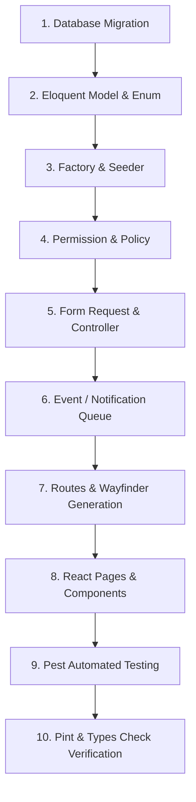

# Technical Documentation — TodoCraft

Dokumentasi teknis untuk pengoperasian, konfigurasi environment, pengujian, panduan alur pengembangan fitur baru, dan arsitektur aplikasi **TodoCraft**.

---

## 📌 Daftar Isi

- [🛠️ Tech Stack](#️-tech-stack)
- [📋 Prasyarat Sistem](#-prasyarat-sistem)
- [🐳 Docker & Makefile Workflows](#-docker--makefile-workflows)
- [⚙️ Setup Environment & Pengoperasian Lokal](#️-setup-environment--pengoperasian-lokal)
- [⏰ Background Scheduler & Task Runner](#-background-scheduler--task-runner)
- [🚀 Panduan Pengembangan Fitur Baru (Step-by-Step Developer Guide)](#-panduan-pengembangan-fitur-baru-step-by-step-developer-guide)
  - [Langkah 1: Database Migration](#langkah-1-database-migration)
  - [Langkah 2: Model Eloquent, Enum, Casts & Relasi](#langkah-2-model-eloquent-enum-casts--relasi)
  - [Langkah 3: Factory & Database Seeder](#langkah-3-factory--database-seeder)
  - [Langkah 4: Permission & Authorization Policy](#langkah-4-permission--authorization-policy)
  - [Langkah 5: Form Request & Controller Action](#langkah-5-form-request--controller-action)
  - [Langkah 6: Notifikasi & Queue (Email / Database)](#langkah-6-notifikasi--queue-email--database)
  - [Langkah 7: Routing & Wayfinder TypeScript Generation](#langkah-7-routing--wayfinder-typescript-generation)
  - [Langkah 8: Tipe TypeScript, Halaman React & Komponen UI](#langkah-8-tipe-typescript-halaman-react--komponen-ui)
  - [Langkah 9: Automated Testing dengan Pest PHP](#langkah-9-automated-testing-dengan-pest-php)
  - [Langkah 10: Formatting & Verifikasi Akhir](#langkah-10-formatting--verifikasi-akhir)
- [🧪 Perintah Testing & Code Quality](#-perintah-testing--code-quality)
- [📁 Struktur Arsitektur Project](#-struktur-arsitektur-project)

---

## 🛠️ Tech Stack

- **Backend**: PHP 8.4, Laravel 11 / 13, Laravel Fortify, Laravel Socialite, Laravel Passkeys
- **Frontend**: React 19, Inertia.js v3, TypeScript, Tailwind CSS v4, Radix UI, Framer Motion, Lucide Icons
- **Routing & Types**: Laravel Wayfinder (`@/actions`, `@/routes`)
- **Database & Query**: MySQL / PostgreSQL / SQLite, `spatie/laravel-query-builder`, `spatie/laravel-permission`, `spatie/laravel-activitylog`, `spatie/laravel-medialibrary`
- **Testing & Quality**: Pest PHP 5, Laravel Pint, PHPStan / Larastan

---

## 📋 Prasyarat Sistem

- **PHP** `>= 8.3` (ekstensi: `pdo`, `mbstring`, `openssl`, `bcmath`, `curl`)
- **Composer** `>= 2.6`
- **Node.js** `>= 20.x` & **npm** `>= 10.x`
- **Database Server**: MySQL 8.x / PostgreSQL 15+ / SQLite3
- **Docker / Podman** *(opsional, jika menggunakan container)*

---

## 🐳 Docker & Makefile Workflows

Jika menggunakan Docker / Podman untuk mengelola layanan infrastruktur pendukung (MySQL, Redis, Mailpit, RustFS/S3):

### 1. Jalankan Container Infrastructure Development:
```bash
make up-dev
# ATAU (menggunakan docker compose secara langsung):
docker compose -f compose.dev.yml up -d
```

### 2. Hentikan Container:
```bash
make down-dev
# ATAU
docker compose -f compose.dev.yml down
```

### 3. Perintah Utama Makefile:
- `make setup` : Setup awal proyek secara otomatis (composer, env, key generate, storage link, migrate --seed, npm install, build, wayfinder).
- `make up-dev` : Menjalankan container Docker dev (MySQL, Redis, Mailpit, S3).
- `make down-dev` : Menghentikan container Docker dev.
- `make run` / `make dev` : Menjalankan dev server Laravel & Vite secara bersamaan (`composer run dev`).
- `make fresh` : Reset database & seeder data (`php artisan migrate:fresh --seed`).
- `make test` : Menjalankan suite pengujian Pest (`php artisan test --compact`).
- `make lint` : Memformat kode PHP dengan Laravel Pint.
- `make wayfinder` : Meng-generate fungsi TypeScript untuk Laravel routes & actions.
- `make clean` : Membersihkan seluruh cache aplikasi (config, route, view, cache).

---

## ⚙️ Setup Environment & Pengoperasian Lokal

### 1. Instalasi Dependensi
```bash
composer install
npm install
```

### 2. Konfigurasi File `.env` & Application Key
```bash
cp .env.example .env
php artisan key:generate
```

### 3. Konfigurasi Database & Migrasi
Sesuaikan kredensial database pada `.env`:
```env
DB_CONNECTION=mysql
DB_HOST=127.0.0.1
DB_PORT=3306
DB_DATABASE=todo_craft
DB_USERNAME=root
DB_PASSWORD=
```

Jalankan migrasi database beserta seeder:
```bash
php artisan migrate:fresh --seed
# ATAU
make fresh
```

### 4. Menjalankan Development Server & Background Scheduler
Perintah terpadu untuk menjalankan HTTP Server, Vite Dev Server, dan **Schedule Worker** (`php artisan schedule:work`) secara bersamaan (*concurrently*):
```bash
make dev
# ATAU
make run
# ATAU
composer run dev
```

Aplikasi berjalan di: `http://localhost:8000`.

---

## ⏰ Background Scheduler & Task Runner

Perintah `make dev` / `make run` secara otomatis sudah menjalankan `php artisan schedule:work` secara paralel. Namun Anda juga dapat menjalankannya secara terpisah jika diperlukan:

### Command Pengingat Todo Manual:
```bash
php artisan todos:send-reminders
```

### Menjalankan Scheduler Secara Terpisah:
```bash
php artisan schedule:work
```
*(Scheduler mengeksekusi `todos:send-reminders` setiap menit untuk memproses queue notifikasi pengingat)*.

---

## 🚀 Panduan Pengembangan Fitur Baru (Step-by-Step Developer Guide)

Panduan ini berisi alur standar yang wajib diikuti oleh developer saat ingin menambahkan atau merombak fitur baru pada **TodoCraft**.



---

### Langkah 1: Database Migration
Buat file migrasi baru untuk membuat atau mengubah tabel database:
```bash
php artisan make:migration create_projects_table
```
- Gunakan tipe data eksplisit (`foreignId('team_id')->constrained()->cascadeOnDelete()`, `string()`, `timestamp()`, `nullable()`).
- Jalankan migrasi:
```bash
php artisan migrate
```

---

### Langkah 2: Model Eloquent, Enum, Casts & Relasi
Buat Model PHP di `app/Models/`:
```bash
php artisan make:model Project
```
- Terapkan PHP 8.4 attributes `#[Fillable(['name', 'team_id'])]` dan `#[Hidden([...])]`.
- Buat Backed Enum di `app/Enums/ProjectStatus.php` jika memiliki kolom berstatus (misal: `enum ProjectStatus: string`).
- Tulis fungsi relasi (`belongsTo(Team::class)`, `hasMany(Todo::class)`) serta tipe casts pada `protected function casts(): array`.

---

### Langkah 3: Factory & Database Seeder
Buat Factory dan Seeder agar data dummy dapat di-generate dengan mudah:
```bash
php artisan make:factory ProjectFactory --model=Project
php artisan make:seeder ProjectSeeder
```
- Daftarkan `ProjectSeeder` pada `database/seeders/DatabaseSeeder.php`.
- Uji cobakan reset database: `make fresh`.

---

### Langkah 4: Permission & Authorization Policy
Semua otorisasi pada aplikasi TodoCraft berbasis **permission string konsisten dengan dot notation** (contoh: `projects.view`, `projects.create`).

1. Daftarkan permission baru pada `database/seeders/RoleAndPermissionSeeder.php` (`PERMISSIONS` array) dan `app/Actions/Teams/CreateTeam.php` (`DEFAULT_ROLES` array).
2. Buat Policy di `app/Policies/`:
```bash
php artisan make:policy ProjectPolicy --model=Project
```
3. Periksa kepemilikan tim dan permission:
```php
public function view(User $user, Project $project): bool
{
    return $user->belongsToTeam($project->team) 
        && ($user->ownsTeam($project->team) || $user->hasTeamPermission($project->team, 'projects.view'));
}
```

---

### Langkah 5: Form Request & Controller Action
Buat Form Request untuk validasi input dan Controller untuk mengani HTTP Request:
```bash
php artisan make:request StoreProjectRequest
php artisan make:controller ProjectController
```
- Gunakan `QueryBuilder::for(Project::class)` dari `spatie/laravel-query-builder` untuk pencarian/filtering di DB.
- Kembalikan komponen Inertia React:
```php
return Inertia::render('projects/index', [
    'projects' => $projects,
]);
```
- Berikan respon pesan flash toast jika berhasil:
```php
Inertia::flash('toast', ['type' => 'success', 'message' => __('Proyek berhasil dibuat.')]);
return back();
```

---

### Langkah 6: Notifikasi & Queue (Email / Database)
Jika fitur membutuhkan pengiriman pemberitahuan atau tugas di background:
```bash
php artisan make:notification ProjectCreatedNotification
```
- Terapkan `implements ShouldQueue` agar dikirim secara asynchronous melalui queue.
- Daftarkan channel `'database'` dan `'mail'` pada method `via()`.
- Kirim notifikasi via `$user->notify(new ProjectCreatedNotification($project))`.

---

### Langkah 7: Routing & Wayfinder TypeScript Generation
Daftarkan rute HTTP pada `routes/web.php` atau `routes/settings.php`:
```php
Route::middleware(['auth', EnsureTeamMembership::class])->group(function () {
    Route::get('{team:slug}/projects', [ProjectController::class, 'index'])->name('projects.index');
    Route::post('{team:slug}/projects', [ProjectController::class, 'store'])->name('projects.store');
});
```
- **Wajib**: Jalankan Wayfinder generator agar TypeScript mengenali rute dan controller action secara otomatis:
```bash
make wayfinder
# ATAU
php artisan wayfinder:generate
```

---

### Langkah 8: Tipe TypeScript, Halaman React & Komponen UI
1. Tentukan antarmuka Tipe Data pada `resources/js/types/project.ts`:
```typescript
export interface Project {
    id: number;
    name: string;
    status: string;
    created_at?: string;
}
```
2. Buat Halaman Inertia React pada `resources/js/pages/projects/index.tsx`:
   - Gunakan layout `@/layouts/app-layout`.
   - Gunakan import rute dari `@/actions` atau `@/routes` (Wayfinder).
   - Gunakan komponen UI dari `@/components/ui/` (Button, Input, Badge, Dialog, Table, dll).

---

### Langkah 9: Automated Testing dengan Pest PHP
Buat Feature Test untuk memastikan fungsionalitas dan boundary keamanannya:
```bash
php artisan make:test --pest Projects/ProjectTest
```
- Tulis skenario pengujian sukses dan skenario kegagalan otorisasi (misal: user luar tim ditolak).
- Jalankan pengujian:
```bash
php artisan test --compact --filter=ProjectTest
```

---

### Langkah 10: Formatting & Verifikasi Akhir
Sebelum mengajukan perubahan atau commit:
1. Memformat kode PHP dengan Laravel Pint:
```bash
make lint
```
2. Memeriksa tipe TypeScript:
```bash
npm run types:check
```
3. Uji kompilasi aset produksi Vite:
```bash
make build
```
4. Jalankan seluruh test suite:
```bash
make test
```

---

## 🧪 Perintah Testing & Code Quality

### Automated Testing (Pest):
```bash
make test
# ATAU
php artisan test --compact
# ATAU
vendor/bin/pest
```

### Code Formatting (Laravel Pint):
```bash
make lint
# ATAU
vendor/bin/pint --dirty --format agent
```

### Static Analysis & Type Checking:
```bash
# TypeScript Type Check
npm run types:check

# PHPStan Static Analysis
vendor/bin/phpstan analyse
```

### Build Production Assets:
```bash
make build
# ATAU
npm run build
```

---

## 📁 Struktur Arsitektur Project

```text
todo-craft/
├── app/
│   ├── Actions/                # Action Classes (CreateTeam, dll)
│   ├── Concerns/               # Reusable Traits (HasTeams, PasswordValidationRules)
│   ├── Console/Commands/       # Custom Artisan Commands (SendTodoReminders)
│   ├── Data/                   # Data Transfer Objects (Spatie Laravel Data)
│   ├── Enums/                  # Application Enums (TeamRole, TeamPermission, TodoPriority)
│   ├── Http/Controllers/       # API & Inertia Controllers
│   ├── Http/Requests/          # Form Request Validation Classes
│   ├── Models/                 # Eloquent Models & Relationships
│   ├── Policies/               # Spatie & Team Authorization Policies
│   └── Notifications/          # Database & Mail Notifications (Queued)
├── database/
│   ├── factories/              # Database Factories
│   ├── migrations/             # Schema Migrations
│   └── seeders/                # Database Seeders
├── resources/
│   └── js/
│       ├── actions/            # Wayfinder Controller Action Types
│       ├── components/         # Shared React Components & UI Primitives
│       ├── layouts/            # App Layouts & Sidebar Templates
│       ├── pages/              # Inertia React Page Components
│       ├── routes/             # Wayfinder Route Functions
│       └── types/              # TypeScript Interface Definitions
├── routes/
│   ├── console.php             # Scheduled Artisan Commands
│   ├── settings.php            # Security, Profile, Team & Role Settings Routes
│   └── web.php                 # Core Web & API Endpoint Definitions
├── Makefile                    # Developer Command Palette
├── compose.dev.yml             # Docker Compose Dev Infrastructure (MySQL, Redis, Mailpit, S3)
└── tests/
    └── Feature/                # Pest Automated Tests
```
